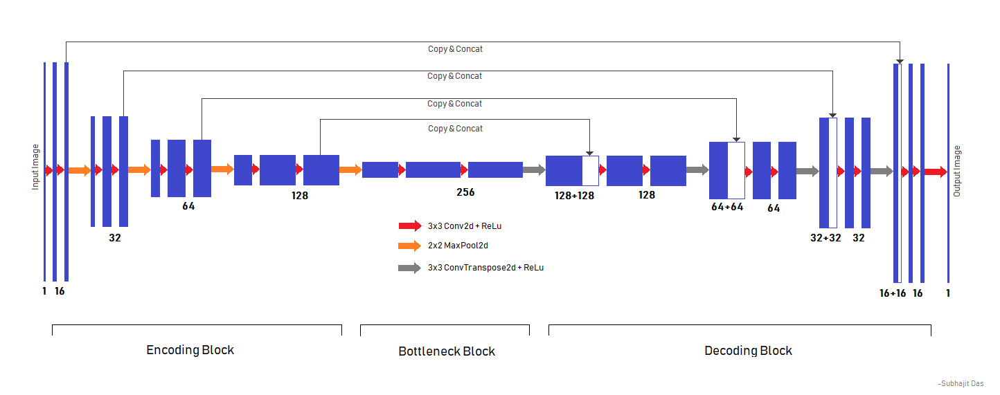
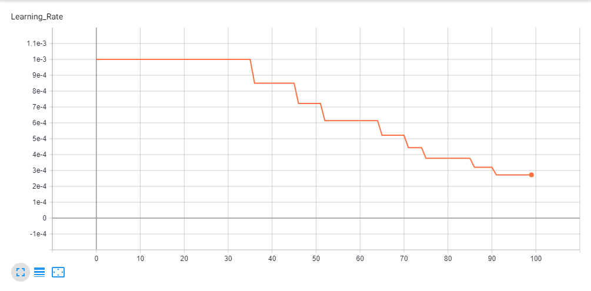
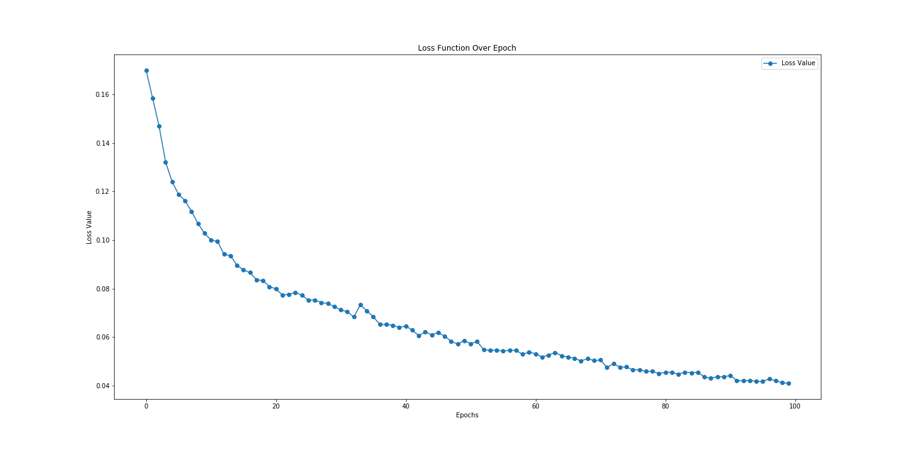
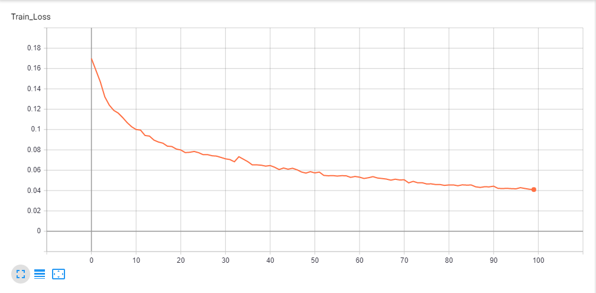

This project uses [U-Net Architecture](https://arxiv.org/abs/1505.04597) to create segmentation masks for brain tumor images.

## Overview
- [Dataset Used](#Dataset-Used)
- [Data Augmentation](#Data-Augmentation)
- [Model Architecture](#Model-Architecture)
- [Training Process](#Training-Process)

### Dataset Used


Original Image             |  Mask Image
:-------------------------:|:-------------------------:
  |  


### Data Augmentation
The basic forms of data augmentation are used here to diversify the training data.
All the augmentation methods are used from [Pytorch's](https://pytorch.org) [Torchvision](https://pytorch.org/docs/stable/torchvision/index.html) module.
- [Horizontally Flip](https://pytorch.org/docs/stable/torchvision/transforms.html#torchvision.transforms.functional.hflip)
- [Vertically Flip](https://pytorch.org/docs/stable/torchvision/transforms.html#torchvision.transforms.functional.vflip)
- [Rotation](https://pytorch.org/docs/stable/torchvision/transforms.html#torchvision.transforms.functional.rotate) Between 75°-15°

Code Responsible for augmentation<br>
<br>
Each augmentation method has a probability of 0.5 and the order of application is also random. For Rotation Augmentation the degree of rotation is chosen randomly between 75°-15°.


### Model Architecture
The model architecture is depicted in this picture.



### Training Process
The model was trained on a [Nvidia GTX 1050Ti](https://www.geforce.com/hardware/desktop-gpus/geforce-gtx-1050-ti/specifications) 4GB GPU. Total time taken for model training was 6 hours and 45 minutes. We started with an initial learning rate of 1e-3 and reduced it by 85% on plateauing, final learning rate at the end of 100 epochs was 2.7249e-4.<br>
Some graphs indicating Learning Rate & Loss Value over 100 epochs are given below.


Learning Rate Graph in Tensorboard.<br>


Loss Graph Plotted in [Matplotlib](https://matplotlib.org)<br>

Loss Graph Plotted in Tensorboard<br><br>

To see the complete output produced during the training process check [this](logs/05-47-51_PM_on_May_20,_2019/training_output_log.txt)

## Installation
This project uses python3.

Clone the project.
```bash
git clone https://github.com/parshwas19/Tumor-Segmentation.git
```
Install Pytorch from this [link](https://pytorch.org/get-started/locally/)<br>
Use pip to install all the dependencies
```bash
pip install -r requirements.txt
```
To open the notebook
```bash
jupyter lab
```
To see logs in Tensorboard
```bash
tensorboard --logdir logs --samples_per_plugin images=100
```
To setup the project dataset
```bash
python setup_scripts/download_dataset.py
python setup_scripts/unzip_dataset.py
python setup_scripts/extract_images.py
```

## Usage

```bash
python api.py --file <file_name> --ofp <optional_output_file_path>
python api.py --folder <folder_name> --odp <optional_output_folder_path>
python api.py -h
```

```
Available api.py Flags
--file  : A single image file name.
--ofp   : An optional folder location only where the output image will be stored. Used only with --file tag.

--folder: Path of a folder containing many image files.
--odp   : An optional folder location only where the output images will be stored. Used only with --folder tag.

-h, --help : Shows the help contents.
```
Some results generated by API are [here](images/API)

## Results
The mean [Dice Score](https://en.wikipedia.org/wiki/S%C3%B8rensen%E2%80%93Dice_coefficient) our model gained was 0.74461 in testing dataset of 600 images.<br>
From this we can conclude that in our testing dataset our constructed mask has a similarity of about 74% with the original mask.<br>


